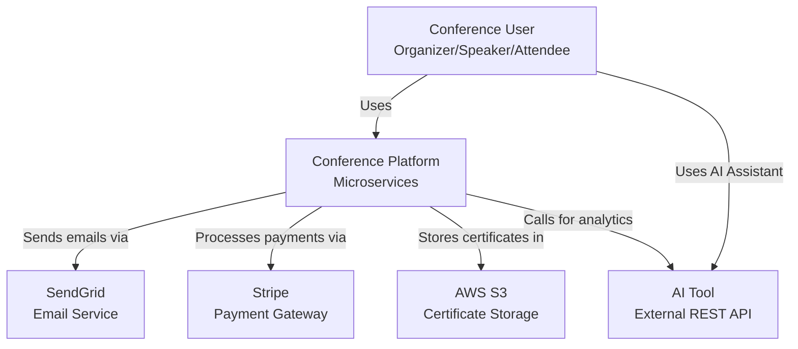

# System Context Diagram

```mermaid
graph TB
    User[Conference User<br/>Organizer/Speaker/Attendee]
    
    System[Conference Platform<br/>Microservices]
    
    Email[SendGrid<br/>Email Service]
    Payment[Stripe<br/>Payment Gateway]
    Storage[AWS S3<br/>Certificate Storage]
    AI[AI Tool<br/>External REST API]
    
    User -->|Uses| System
    System -->|Sends emails via| Email
    System -->|Processes payments via| Payment
    System -->|Stores certificates in| Storage
    User -->|Uses AI Assistant| AI
    System -->|Calls for analytics| AI
```
