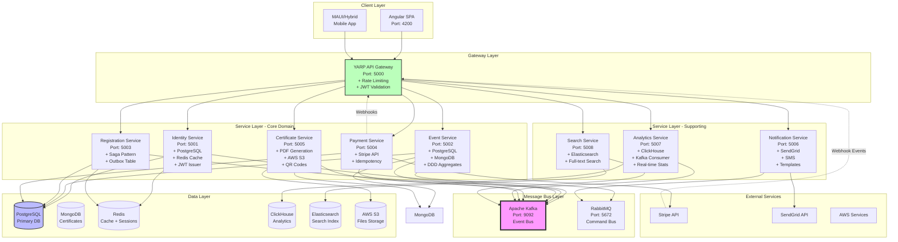

# Container Diagram - Microservices Architecture

```mermaid
graph TB
    subgraph "Client Layer"
        Browser[Angular SPA<br/>Port: 4200]
        Mobile[MAUI/Hybrid<br/>Mobile App]
    end
    
    subgraph "Gateway Layer"
        Gateway[YARP API Gateway<br/>Port: 5000<br/>+ Rate Limiting<br/>+ JWT Validation]
    end
    
    subgraph "Service Layer - Core Domain"
        Identity[Identity Service<br/>Port: 5001<br/>+ PostgreSQL<br/>+ Redis Cache<br/>+ JWT Issuer]
        
        EventMgmt[Event Service<br/>Port: 5002<br/>+ PostgreSQL<br/>+ MongoDB<br/>+ DDD Aggregates]
        
        Registration[Registration Service<br/>Port: 5003<br/>+ Saga Pattern<br/>+ Outbox Table]
        
        Payment[Payment Service<br/>Port: 5004<br/>+ Stripe API<br/>+ Idempotency]
        
        Certificate[Certificate Service<br/>Port: 5005<br/>+ PDF Generation<br/>+ AWS S3<br/>+ QR Codes]
    end
    
    subgraph "Service Layer - Supporting"
        Notification[Notification Service<br/>Port: 5006<br/>+ SendGrid<br/>+ SMS<br/>+ Templates]
        
        Analytics[Analytics Service<br/>Port: 5007<br/>+ ClickHouse<br/>+ Kafka Consumer<br/>+ Real-time Stats]
        
        Search[Search Service<br/>Port: 5008<br/>+ Elasticsearch<br/>+ Full-text Search]
    end
    
    subgraph "Message Bus Layer"
        Kafka[Apache Kafka<br/>Port: 9092<br/>Event Bus]
        RabbitMQ[RabbitMQ<br/>Port: 5672<br/>Command Bus]
    end
    
    subgraph "Data Layer"
        Postgres[(PostgreSQL<br/>Primary DB)]
        Mongo[(MongoDB<br/>Certificates)]
        Redis[(Redis<br/>Cache + Sessions)]
        ClickHouse[(ClickHouse<br/>Analytics)]
        Elastic[(Elasticsearch<br/>Search Index)]
        S3[(AWS S3<br/>Files Storage)]
    end
    
    subgraph "External Services"
        Stripe[Stripe API]
        SendGrid[SendGrid API]
        AWS[AWS Services]
    end
    
    Browser --> Gateway
    Mobile --> Gateway
    
    Gateway --> Identity
    Gateway --> EventMgmt
    Gateway --> Registration
    Gateway --> Payment
    Gateway --> Certificate
    Gateway --> Notification
    Gateway --> Analytics
    Gateway --> Search
    
    Identity --> Postgres
    Identity --> Redis
    Identity --> Kafka
    
    EventMgmt --> Postgres
    EventMgmt --> MongoDB
    EventMgmt --> Kafka
    EventMgmt --> RabbitMQ
    
    Registration --> Postgres
    Registration --> Redis
    Registration --> Kafka
    
    Payment --> Postgres
    Payment --> Stripe
    Payment --> Kafka
    
    Certificate --> MongoDB
    Certificate --> S3
    Certificate --> Kafka
    
    Notification --> SendGrid
    Notification --> RabbitMQ
    
    Analytics --> ClickHouse
    Analytics --> Kafka
    
    Search --> Elastic
    Search --> Kafka
    
    Payment -.->|Webhooks| Gateway
    Stripe -.->|Webhook Events| Gateway
    
    style Kafka fill:#f9f,stroke:#333,stroke-width:4px
    style Postgres fill:#bbf,stroke:#333,stroke-width:2px
    style Gateway fill:#bfb,stroke:#333,stroke-width:2px
```
