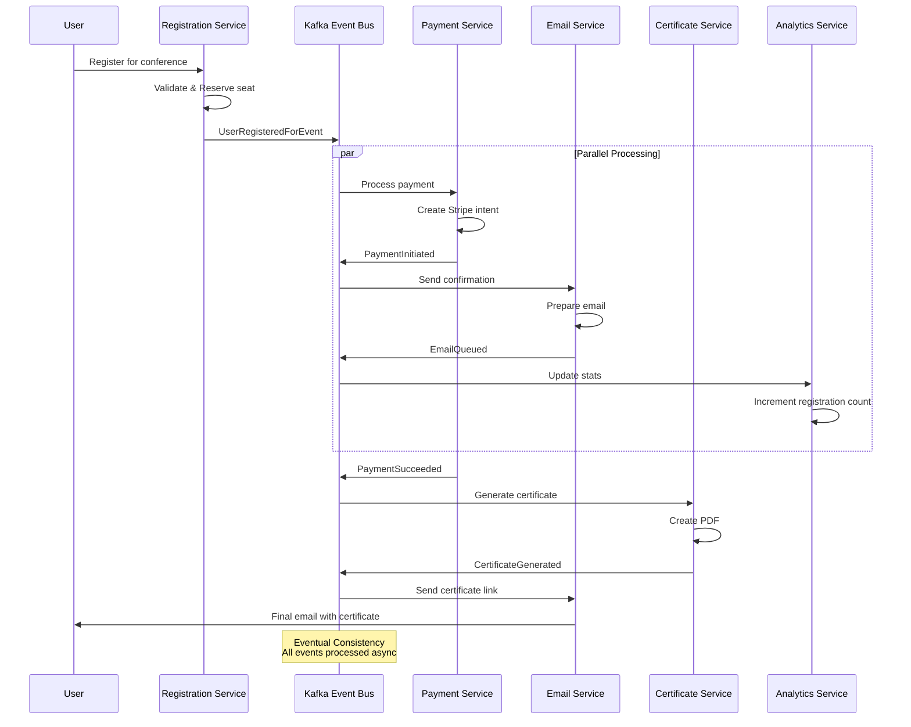

# Event Flow - Kafka Topics

```mermaid
sequenceDiagram
    participant User as User
    participant Reg as Registration Service
    participant Kafka as Kafka Event Bus
    participant Payment as Payment Service
    participant Email as Email Service
    participant Cert as Certificate Service
    participant Analytics as Analytics Service
    
    User->>Reg: Register for conference
    
    Reg->>Reg: Validate & Reserve seat
    Reg->>Kafka: UserRegisteredForEvent
    
    par Parallel Processing
        Kafka->>Payment: Process payment
        Payment->>Payment: Create Stripe intent
        Payment->>Kafka: PaymentInitiated
        
        Kafka->>Email: Send confirmation
        Email->>Email: Prepare email
        Email->>Kafka: EmailQueued
        
        Kafka->>Analytics: Update stats
        Analytics->>Analytics: Increment registration count
    end
    
    Payment->>Kafka: PaymentSucceeded
    Kafka->>Cert: Generate certificate
    Cert->>Cert: Create PDF
    Cert->>Kafka: CertificateGenerated
    
    Kafka->>Email: Send certificate link
    Email->>User: Final email with certificate
    
    Note over Kafka: Eventual Consistency<br/>All events processed async
```
